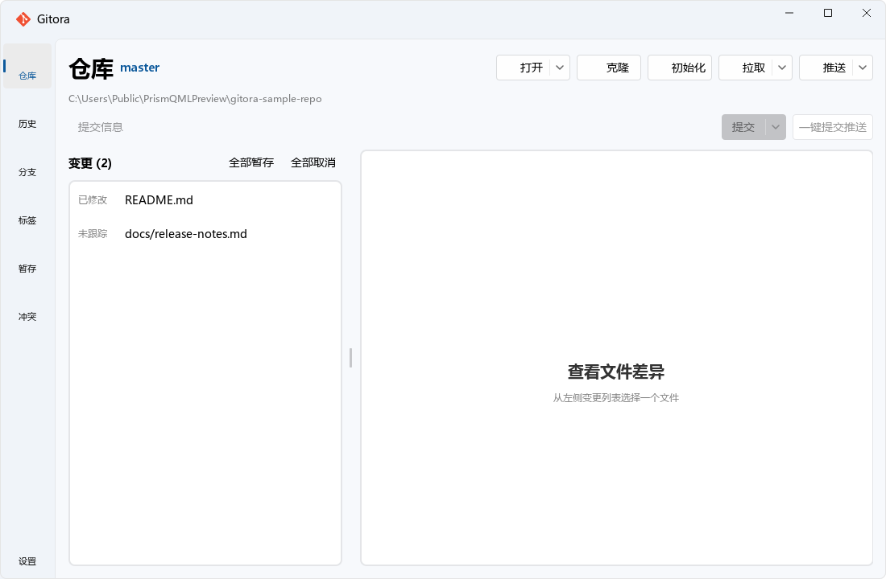

# Gitora

> 对新手友好的 Git 可视化工具，基于 [PrismQML](https://github.com/aki-riko/PrismQML) 的现代化桌面客户端。

Gitora 用 Fluent Design 风格把常见 Git 操作做成清晰直观的界面——暂存、提交、推送、分支、标签、stash、冲突解决，一站式完成，无需记命令。



- **下载**：[GitHub Releases](https://github.com/aki-riko/Gitora/releases)
- **适合**：想少记命令、用图形界面完成日常 Git 工作流的新手与桌面端用户。

## ✨ 特性

- 🎯 **新手友好** — 清晰的操作界面，一键暂存 + 提交 + 推送
- 🚀 **功能完善** — 文件差异（增删着色）、提交时间线、分支/标签/Stash 管理、冲突解决、Reflog、文件历史
- 🎨 **现代美观** — Fluent Design，亮/暗主题，Mica 半透明，平滑滚动
- ⚡ **流畅不卡** — Git 操作全异步（不阻塞界面），大仓库历史虚拟滚动
- 🤖 **AI 提交规划** — 可连接本地 Ollama、远程 OpenAI 兼容 API（Chat Completions / Responses）或 Anthropic Messages API，生成提交信息并按文件/代码块规划原子提交
- 🔒 **安全可靠** — 危险操作倒计时二次确认，ref/URL/路径校验，完整边界处理
- 🔍 **全盘扫描** — 后台自动扫描磁盘上的 Git 仓库，一键打开
- 🪟 **单实例** — 重复启动自动激活已有窗口，不开多个

## 下载

前往 [Releases](https://github.com/aki-riko/Gitora/releases) 下载 `Gitora-Setup-x.y.z.exe`（Windows 安装包，已内置运行时，无需 Python 环境）。

> 需要本机已安装 [Git](https://git-scm.com/) 命令行工具，首次启动会自动检测。

## 技术栈

- **UI**: [PrismQML](https://github.com/aki-riko/PrismQML)（MIT，纯 QML 声明式多皮肤 UI 引擎）
- **运行时**: PySide6 (Qt for Python)
- **后端**: Python 封装 git 命令行（subprocess），异步执行

## 从源码运行

需要 Python 3.10+ 和已安装的 Git 命令行工具。

```bash
# 1. 安装依赖（含 PrismQML: pip 包名 prismqml）
pip install -r app_qml/requirements.txt

# 2. 启动
python app_qml/main_qml.py
```

依赖 `prismqml >= 0.2.24`（PrismQML，提供多皮肤 UI 引擎、Timeline 虚拟滚动、单实例 IPC、自动更新等特性）。

## 打包

```bash
# 1. Nuitka 编译为 standalone exe（产物在 build_dist/main_qml.dist/）
python build_nuitka.py

# 2. InnoSetup 生成安装包（需安装 Inno Setup 6/7）
ISCC installer.iss   # 产物在 dist_installer/
```

## 功能

- 打开 / 克隆 / 初始化仓库，最近仓库 + 全盘扫描下拉
- 文件变更：暂存 / 取消 / 丢弃，差异着色显示
- 提交、修改提交、一键提交推送
- AI 提交规划：生成可编辑提交信息，按文件或代码块拆分并逐组复核提交
- 拉取 / 推送 / 获取（异步，无远程 / 落后等边界友好提示）
- 提交历史：按日期分组时间线、搜索、详情、Reflog
- 分支：本地 / 远程、切换 / 创建 / 删除、ahead/behind 显示
- 标签：创建 / 检出 / 推送 / 删除
- Stash：保存 / 应用 / 恢复 / 删除
- 冲突解决：本地优先 / 远程优先、冲突内容高亮查看
- 设置：主题 / 语言 / Mica / 仓库维护

## 项目结构

```
Gitora/
├── app/
│   ├── common/          # Git 后端(命令封装/日志/最近仓库/安装检测)
│   └── resource/        # logo 与图标资源
└── app_qml/
    ├── main_qml.py      # 入口(PrismQML App + 注册后端 + 加载 QML)
    ├── backend/         # QML 对接层(GitBridge/RepoScanner)
    └── qml/             # QML 界面(views 页面 + components 组件)
```

详见 [app_qml/README.md](app_qml/README.md)（架构与设计说明）。

AI 提交规划器的配置、隐私边界、使用流程和故障排查见
[AI 提交规划器使用指南](docs/ai-commit-planner.md)。v1.3.0 的发布范围和已知限制见
[v1.3.0 发布说明](docs/release-notes-v1.3.0.md)。

## 许可证

[MIT](LICENSE) © 2025 aki-riko
