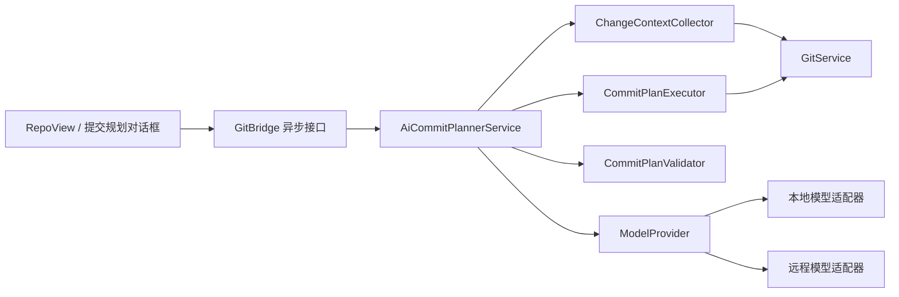

# AI 提交规划器实施计划

> 创建日期: 2026-07-22
> 状态: 已实施（v1.3.0；真实模型质量评测待运行）
> 用途: 作为 Gitora 引入大模型提交信息生成、文件级提交规划和代码块级原子提交拆分的产品、架构与验收基线。

## 一、结论与产品定位

Gitora 应实现“AI 提交规划器”，而不只是在提交输入框旁增加一个生成文案按钮。

规划器的完整职责是:

1. 分析当前暂存区和工作区改动。
2. 建议应拆分为几个具有单一目的的提交。
3. 为每个提交分配文件或代码块。
4. 生成符合当前仓库历史风格的提交标题和正文。
5. 解释拆分理由、依赖顺序和风险。
6. 在确定性校验通过后，由用户逐组确认并执行。

核心原则:

> 模型只负责提出计划，Gitora 负责验证和执行，用户保留最终决定权。

## 二、现状依据

当前仓库已经具备以下基础能力:

| 能力 | 当前入口 | 可复用程度 |
|---|---|---:|
| 提交信息输入、普通提交、一键提交推送 | `RepoView.commitInput`、`GitBridge.commit`、`quickCommitPush` | 高 |
| 文件级暂存和取消暂存 | `GitService.stage_file`、`unstage_file` | 高 |
| 暂存区与工作区差异获取 | `GitService.get_diff(staged=...)` | 中 |
| 统一差异解析 | `GitService.parse_unified_diff` | 高 |
| 最近提交历史 | `GitService.get_log` | 高 |
| 异步任务与过期结果丢弃 | `GitBridge` 的请求标识和信号机制 | 高 |

当前缺口:

- 没有模型提供方抽象、模型配置和安全凭据存储。
- 没有面向模型的完整变更快照与稳定变更标识。
- 没有结构化提交计划协议和确定性校验器。
- 暂存操作只到文件级，没有代码块级暂存与补丁执行能力。
- 普通差异展示存在截断逻辑，不能直接作为完整规划输入。
- 没有计划预览、调整顺序、重新分组和逐组执行界面。

## 三、目标与非目标

### 3.1 目标

- 为已暂存改动生成可编辑的提交标题和正文。
- 为工作区全部改动生成一个或多个文件级提交建议。
- 最终支持把同一文件中的不同代码块分配到不同提交。
- 支持本地模型和用户主动配置的远程模型。
- 根据当前仓库最近提交记录适配语言和标题风格。
- 对遗漏、重复、过期计划和不可应用补丁执行强制拦截。
- 全过程可取消、可审阅，不静默提交，不自动推送。

### 3.2 非目标

- 第一版不内置或随安装包分发大体积模型权重。
- 第一版不承诺全自动生成后连续提交。
- 不让模型运行任意 Git、Shell 或项目命令。
- 不让模型决定是否强制推送、重写远程历史或丢弃改动。
- 不用模型输出替代 Git 状态、补丁应用和覆盖校验结果。
- 不把模型生成质量等同于代码正确性或测试通过。

## 四、用户流程

### 4.1 生成单条提交信息

1. 用户按现有方式暂存改动。
2. 点击“生成提交信息”。
3. Gitora 收集已暂存差异、最近提交标题和仓库提交规范。
4. 模型返回标题、可选正文、摘要和警告。
5. 用户编辑后使用现有提交按钮提交。

该模式不修改暂存区，是首个可交付版本。

### 4.2 文件级多提交规划

1. 用户点击“规划提交”。
2. Gitora 为当前改动生成不可变快照和工作区指纹。
3. 模型返回若干提交组，每组包含文件、信息、理由和依赖。
   当规划范围包含两个以上改动时，协议至少要求两个提交组；模型仍负责决定具体拆分数量和边界。
4. Gitora 检查每项改动是否恰好分配一次。
5. 用户可编辑信息、移动文件、调整提交顺序或删除空组。
6. 用户点击“应用下一组”，Gitora 暂存该组并回到现有差异界面复核。
7. 用户确认提交后继续下一组。

第一版文件级执行采用“逐组应用、逐组确认”，不做不可见的批量连提。

### 4.3 代码块级原子提交

在文件级流程稳定后，允许一个文件的不同代码块进入不同提交。界面应展示每个代码块的上下文、所属提交和覆盖状态，并支持拖动调整。

代码块级执行只有在以下条件全部满足时才能启用:

- 稳定代码块标识已经建立。
- 计划中的每个代码块恰好出现一次。
- 生成的补丁可以在临时索引中完整应用。
- 当前 `HEAD`、索引和工作区指纹与规划时一致。
- 没有未处理冲突、子模块歧义或不支持的二进制变更。

## 五、总体架构



建议新增模块边界:

| 模块 | 职责 |
|---|---|
| `ChangeContextCollector` | 获取状态、差异、历史风格、仓库规范并生成快照 |
| `ModelProvider` | 统一模型调用、取消、超时、错误和结构化输出接口 |
| `AiCommitPlannerService` | 构造请求、调用模型、协调校验与结果转换 |
| `CommitPlanValidator` | 校验结构、覆盖、重复、顺序、指纹和补丁可应用性 |
| `CommitPlanExecutor` | 将用户确认的单组计划转换为确定性暂存操作 |
| `AiCommitPlanModel` | 向 QML 暴露提交组、变更项、警告和执行状态 |

模型提供方不得直接依赖 QML，也不得直接调用 `GitService` 执行写操作。

## 六、变更快照与输入边界

### 6.1 快照内容

每次规划应记录:

- 仓库规范化路径的内部标识，不向模型暴露无关的绝对路径。
- 当前分支和 `HEAD`。
- 暂存区树标识。
- 已暂存、未暂存、未跟踪、重命名、删除和二进制状态。
- 暂存区差异和工作区差异，两者不得混为同一份内容。
- 最近提交标题样本，只用于学习格式和语言。
- 可选的仓库提交规范，例如 `AGENTS.md`、`CONTRIBUTING.md` 中明确的提交要求。
- 由上述内容计算的工作区指纹。

### 6.2 稳定变更标识

模型不应通过数组下标或自由文本描述引用改动。每个变更项由 Gitora 生成稳定 `change_id`，至少绑定:

- 快照标识。
- 暂存状态。
- 规范化仓库相对路径。
- 旧路径和新路径。
- 变更类型。
- 代码块头和内容摘要。

模型只能返回 Gitora 已提供的 `change_id`，不能自行创造路径或代码块。

### 6.3 大型与特殊改动

- 模型输入不能复用界面层已经截断的差异。
- 输入大小、单文件大小、文件数和历史样本数必须来自配置，不散落硬编码。
- 超限时优先按文件生成摘要，再进行分层规划。
- 二进制、子模块、生成物和无法安全读取的文件只提供元数据并显示警告。
- 未跟踪文件的内容读取必须经过仓库路径边界检查和大小限制。
- 任何截断都必须进入结构化元数据，界面明确显示“计划基于不完整内容”。
- 基于不完整内容的计划默认禁止自动应用，只能作为建议查看。

## 七、结构化计划协议

模型返回值必须通过严格结构校验，禁止从自然语言中猜测执行指令。概念结构如下:

```json
{
  "schema_version": "1",
  "snapshot_id": "由 Gitora 提供并原样返回",
  "summary": "本次改动摘要",
  "groups": [
    {
      "group_id": "建议组标识",
      "title": "提交标题",
      "body": "可选提交正文",
      "change_ids": ["已有变更标识"],
      "depends_on": [],
      "rationale": "拆分理由",
      "warnings": []
    }
  ],
  "unassigned_change_ids": [],
  "warnings": []
}
```

确定性校验至少包括:

- 协议版本受支持。
- 快照标识与当前请求一致。
- 所有 `change_id` 均来自请求。
- 没有重复分配。
- 没有遗漏；若有遗漏，只能展示计划，不能执行。
- 提交标题非空且不含控制字符。
- 依赖图无环，排序结果唯一可解释。
- 空组、未知字段和超限内容得到明确错误。
- 当前工作区指纹未变化。
- 执行前补丁试应用成功。

模型给出的置信度只能用于提示，不能绕过上述校验。

## 八、模型提供方策略

### 8.1 统一接口

所有提供方实现同一异步协议:

- 接收结构化规划请求。
- 返回结构化计划或明确错误。
- 支持取消、超时和进度状态。
- 报告实际使用的提供方和模型标识。
- 不在日志中记录密钥或完整源代码。

提供方地址、模型名、超时、输入上限和采样参数全部由设置或环境配置提供，禁止写死在源码中。

### 8.2 本地模型

首版采用“连接用户已有的本地模型运行时”，不把模型权重打入 Gitora 安装包。优势是代码不离开机器、无按次调用费用；限制是硬件差异大，复杂跨文件规划质量可能不稳定。

本地模式必须允许用户先执行连接测试，并展示模型标识、可用状态和错误原因。

### 8.3 远程模型

远程模式必须满足:

- 用户显式启用并选择提供方。
- 调用前显示将发送的文件范围、字符量和是否包含源码正文。
- 密钥不写入仓库、普通配置文件、崩溃报告或日志。
- 提供“仅发送已暂存差异”和“允许发送全部工作区差异”的独立选择。
- 支持立即取消，取消后不执行任何提交操作。

安全凭据已采用操作系统原生后端：Windows Credential Manager 与 macOS Keychain。图形界面输入的密钥只持久化到当前用户系统凭据库，不写普通配置文件；环境变量仅保留为自动化兼容回退，且系统凭据优先。打包态自检必须用唯一临时条目完成写入、读取、删除和删除确认，不接触用户真实 Gitora 密钥。

## 九、安全与正确性边界

### 9.1 模型内容视为不可信输入

- 差异、源码注释和仓库文档中可能包含针对模型的诱导文字。
- 提示模板必须把仓库内容明确界定为数据，而不是可执行指令。
- 模型没有工具调用能力，不得读取请求范围外文件。
- 模型输出不允许携带 Shell 命令并被程序执行。
- 路径必须由 Gitora 的变更标识反查，不能直接信任模型输出路径。

### 9.2 工作区一致性

- 规划开始时生成快照，规划完成后重新计算指纹。
- 用户编辑文件、切换仓库、切换分支、暂存或取消暂存后，旧计划立即标记为过期。
- 异步结果必须绑定仓库和请求标识，切仓库后的旧结果直接丢弃。
- 执行期间获取应用级操作锁，避免多个提交任务并发修改索引。

### 9.3 执行与恢复

- 第一版一次只应用一个提交组。
- 应用前保存索引状态和计划快照，验证失败时不修改索引。
- 暂存完成后回到现有差异视图，由用户再次确认实际内容。
- 一旦某个提交已经成功，不自动通过 reset、rebase 或 amend 回滚历史。
- 后续组失败时停止执行，保留已完成提交和剩余工作区，并给出可操作说明。
- 推送始终沿用现有显式入口，规划器不自动推送。

## 十、界面方案

### 10.1 仓库页入口

在现有提交区增加一个“AI 规划”入口，提供:

- “生成当前提交信息”。
- “规划多个提交”。
- 当前模型和本地/远程状态提示。

模型不可用时不隐藏入口，而是显示可理解的配置引导。

### 10.2 规划对话框

规划对话框至少包含:

- 顶部: 快照范围、模型、隐私模式、耗时和过期状态。
- 左侧: 全部变更项及未分配状态。
- 主区: 按顺序排列的提交组卡片。
- 每组: 标题、正文、文件或代码块、拆分理由、警告。
- 操作: 重新生成、手动新增组、移动变更、调整顺序、应用下一组。
- 底部: 覆盖校验、风险提示和执行按钮。

执行按钮只有在覆盖完整、计划未过期、补丁试应用成功时才启用。

### 10.3 状态反馈

- 模型调用必须异步，不阻塞 QML 主线程。
- 显示“收集上下文、等待模型、校验计划、准备执行”等明确阶段。
- 用户可以取消；取消后保留已有输入，不清空提交信息。
- 错误必须区分配置错误、网络错误、模型输出错误、工作区过期和 Git 执行错误。

## 十一、实施阶段

### P0: 特征化与协议定稿

预期工时: 8–12 小时
风险: 低

- 建立真实变更快照夹具。
- 定义模型请求、响应和错误协议。
- 定义工作区指纹和 `change_id`。
- 验证差异截断、部分暂存、未跟踪文件和二进制边界。
- 建立模型提供方的假实现，先完成确定性测试。

完成判据:

- 协议可以覆盖单提交、文件级多提交和未来代码块级规划。
- 所有边界均有不依赖真实模型的测试夹具。
- 没有任何 Git 写操作。

### P1: 已暂存内容生成提交信息

预期工时: 16–24 小时
风险: 中

- 实现上下文收集器和提供方抽象。
- 增加本地与远程模型配置入口。
- 增加异步生成、取消、错误处理和过期结果丢弃。
- 把结果填入现有提交输入框，提交仍走现有流程。
- 补充凭据、日志脱敏和云端发送确认。

完成判据:

- 不暂存、不取消暂存、不自动提交。
- 对空暂存区、超大差异、二进制和模型异常给出明确提示。
- 真实临时仓库和 QML 契约测试通过。

### P2: 文件级多提交规划

拆为三个独立子阶段，每个预期 16–24 小时。
风险: 中

1. 规划协议、覆盖校验和历史风格提取。
2. 提交组模型、规划对话框和手动调整交互。
3. 逐组暂存、工作区指纹校验和真实仓库执行测试。

完成判据:

- 每个文件级变更恰好分配一次。
- 部分暂存的同一文件不会被错误地当作完整文件自动应用。
- 用户可以在执行前看到每组实际差异。
- 任何组失败后不继续自动执行下一组。
- 不自动推送。

### P3: 代码块级原子提交

拆为三个独立子阶段，每个预期 16–24 小时。
风险: 高

1. 稳定代码块标识、补丁构造和试应用。
2. 代码块分组界面、覆盖视图和手动调整。
3. 临时索引验证、恢复路径和完整真实仓库矩阵。

完成判据:

- 代码块覆盖率和去重率均为 100%。
- 所有执行补丁先在隔离环境试应用。
- 规划时与执行时上下文不一致会被强制拦截。
- 同一文件的多个提交组可以在真实仓库按顺序完成。

### P4: 质量评测与发布准备

预期工时: 12–20 小时
风险: 中

- 建立历史提交回放集和人工评价表。
- 对本地小模型与远程模型分别记录质量、耗时和失败类型。
- 补充隐私说明、配置文档、故障排查和功能开关。
- 完成 Windows、macOS 打包后的连接与启动验证。

## 十二、测试与验收矩阵

### 12.1 确定性单元测试

- 结构化输出正常、缺字段、未知标识、重复标识和遗漏标识。
- 依赖排序、循环依赖和空提交组。
- 指纹一致、文件变化、索引变化、`HEAD` 变化和切换仓库。
- 超时、取消、网络失败、无效结构、返回截断和提供方限流。
- 日志不包含密钥、完整请求头和源代码正文。
- 仓库内容中的诱导文字不会变成可执行操作。

### 12.2 真实临时仓库集成测试

| 场景 | 预期 |
|---|---|
| 只有已暂存改动 | 可生成单条提交信息 |
| 只有未暂存改动 | 单条信息模式拒绝，规划模式可分析 |
| 同一文件同时已暂存和未暂存 | 两类改动保持独立，不错误覆盖 |
| 多文件可自然拆分 | 生成多个可调整提交组 |
| 重命名、删除和新增文件 | 标识稳定，路径映射正确 |
| 未跟踪文件 | 经过路径和大小检查后纳入 |
| 二进制和子模块 | 只展示元数据并警告 |
| 超大差异 | 降级或拒绝执行，不静默截断 |
| 包含空格、中文和特殊字符的路径 | 规划和暂存均正确 |
| 合并或变基冲突中 | 禁止启动自动执行 |
| 规划后用户继续编辑 | 计划过期，执行按钮禁用 |
| 某组暂存或提交失败 | 停止后续组并保留可恢复状态 |

### 12.3 模型质量评测

从真实历史中选择连续、逻辑清晰的提交序列，合并为一个差异后让模型重建提交计划。模型质量和 Git 正确性分别评价。

首轮建议至少准备 30 组真实样本，覆盖 Python、QML、测试、文档和混合改动。

硬性指标:

- 结构化协议解析成功率: 100%。
- 已知变更覆盖率: 100%。
- 重复分配率: 0%。
- 执行前补丁试应用成功率: 100%。
- 云端源码发送前用户可见确认率: 100%。
- 计划过期后的错误执行次数: 0。

产品观察指标:

- 用户无需重新分组即可接受的计划比例。
- 标题无需修改即可采用的比例。
- 用户删除、合并或拆分提交组的频率。
- 本地和远程模型的完成耗时、取消率和失败率。

主观指标在第一轮真实试用后设定发布门槛，不用伪造样本得出结论。

## 十三、主要风险

| 风险 | 等级 | 控制措施 |
|---|---:|---|
| 模型遗漏或重复代码块 | 高 | 稳定标识、100% 覆盖校验、补丁试应用 |
| 计划生成后工作区继续变化 | 高 | 快照指纹、过期失效、执行前复验 |
| 云端模型造成源码泄露 | 高 | 默认不启用、发送预览、显式授权、安全凭据 |
| 模型被源码内容诱导 | 高 | 内容视为数据、无工具权限、严格结构协议 |
| 多提交执行中途失败 | 高 | 逐组确认、失败即停、不自动重写历史 |
| 本地模型质量和速度不稳定 | 中 | 连接测试、可取消、质量评测、提供方可替换 |
| 超大差异消耗过高 | 中 | 可配置上限、分层摘要、明确降级 |
| 部分暂存状态被破坏 | 高 | 分离暂存/未暂存快照，文件级阶段限制自动应用 |
| Git Hooks 或签名导致提交失败 | 中 | 沿用真实提交路径，保留原始错误，禁止静默绕过 |

## 十四、实施顺序建议

1. 先完成 P0，不接真实模型也能把协议、快照和校验测试跑通。
2. P1 先接一种本地提供方和一种远程提供方，但保持接口可替换。
3. 用 P1 收集真实提交信息效果和失败样本。
4. P2 优先交付“规划与手动调整”，再接逐组暂存。
5. P2 经真实使用确认有价值后，再投入 P3 代码块级执行。
6. 每个阶段独立提交、测试和审查，不把模型接入、复杂 UI 与补丁执行塞进同一批改动。

## 十五、已确认的实施决策与剩余评测项

- 首批本地运行时为 Ollama，远程提供方为 Responses API。
- Windows 使用 Credential Manager，macOS 使用 Keychain；图形界面不提供进程内临时密钥路径。
- 提交正文默认生成，用户可以在设置中关闭。
- 仓库规范文件白名单为 `AGENTS.md` 与 `CONTRIBUTING.md`，并受字符上限约束。
- 文件级规划默认只分析已暂存改动，用户可以显式切换到全部工作区改动。
- Gitora 不允许模型决定或运行项目测试命令，提交前验证仍由用户执行。
- 已建立 30 组真实历史回放集和本地/远程人工评价表；真实模型接受率、标题质量和端到端延迟仍待配置模型后运行，不从静态测试推断。

## 十六、完成定义

整个功能只有同时满足以下条件才可称为完成:

- 本地和远程模式均有清晰配置、错误和隐私反馈。
- 模型输出经过结构、覆盖、指纹和补丁四层确定性校验。
- 用户可以查看、编辑、调整并逐组确认计划。
- 不存在模型直接执行命令、自动推送或绕过危险确认的路径。
- 单元测试、真实临时仓库集成测试和 QML 契约测试全部通过。
- Windows 完整重启后的运行验证通过。
- macOS CI 构建、自检和模型配置界面验证通过。
- 发布说明明确本地/远程差异、数据发送边界和已知限制。
